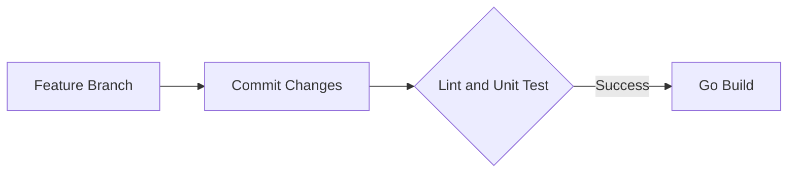
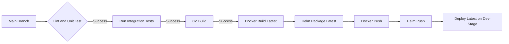
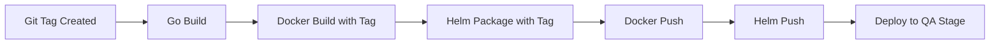

```mermaid
graph LR;
    A[Feature Branch] --> B[Commit Changes];
    B --> C{Lint and Unit Test};
    C -->|Success| D[Go Build];
```

```mermaid
graph LR;
    A[Main Branch] --> B{Lint and Unit Test};
    B -->|Success| C[Run Integration Tests];
    C -->|Success| D[Go Build];
    D -->|Success| E[Docker Build Latest];
    E --> F[Helm Package Latest];
    F --> G[Docker Push];
    G --> H[Helm Push];
    H --> I[Deploy Latest on Dev-Stage];
```

```mermaid
graph LR;
    A[Git Tag Created] --> B[Go Build];
    B --> C[Docker Build with Tag];
    C --> D[Helm Package with Tag];
    D --> E[Docker Push];
    E --> F[Helm Push];
    F --> G[Deploy to QA Stage];

```
